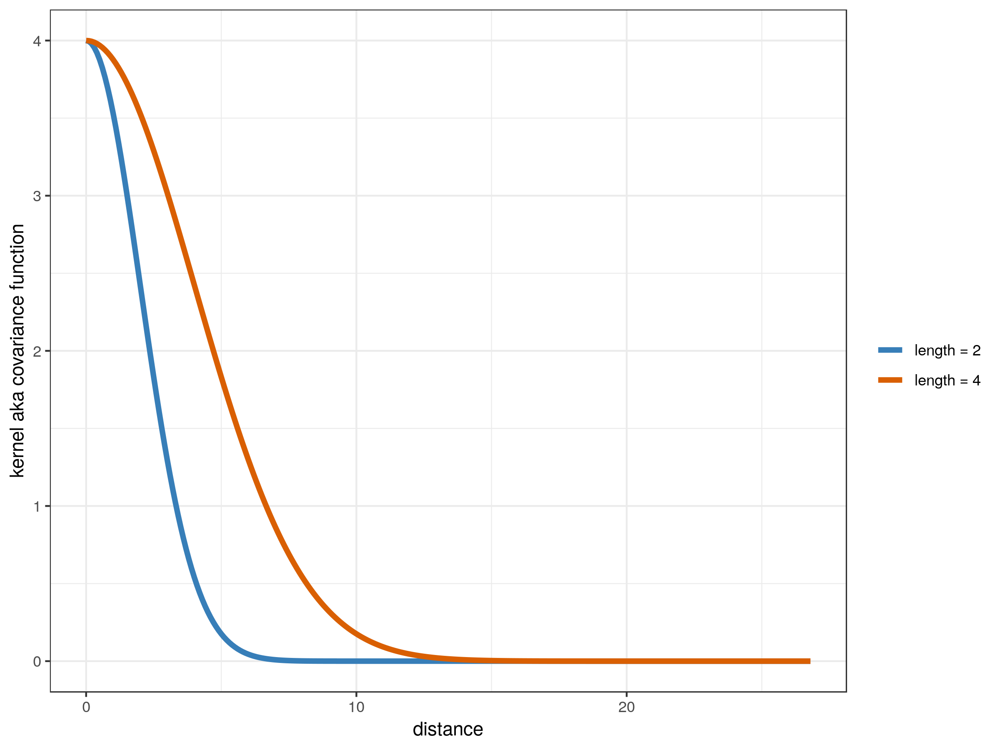

# regression_with_spatial_correlation

What happens when you fit a linear regression to spatially correlated data,
and calculate std errors and confidence intervals assuming the data are i.i.d.?

In this simulation, the researcher's goal is to produce unbiased estimates and valid
confidence intervals for beta_hat in a setting where Y = constant + x*beta + epsilon.

Related:
 - https://voxeu.org/article/standard-errors-persistence
 - https://papers.ssrn.com/sol3/papers.cfm?abstract_id=3398303
 - https://peterroelants.github.io/posts/gaussian-process-kernels/
 - https://www.stat.purdue.edu/~boli/stat512/lectures/topic3.pdf

